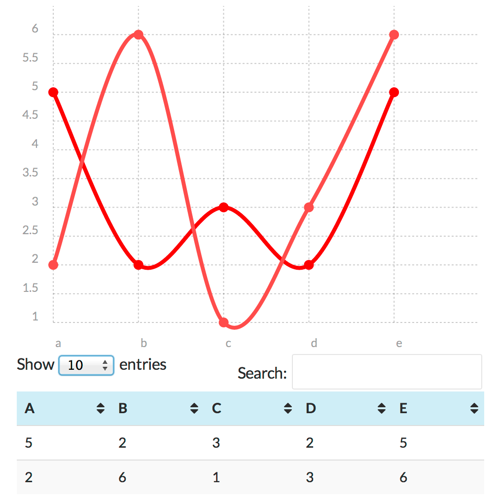

#TablePress Extension: Chartist

##About

Using [Chartist.js](http://gionkunz.github.io/chartist-js/), this [TablePress](https://tablepress.org/) extension  creates a chart based on the data in your TablePress table

##Usage

Add `chartist=true` parameter to your TablePress shortcode, eg: `[table id=1 chartist=true /]`

**Optional parameters**

* Hide the table, `chartist_table_hide=true` eg: `[table id=1 chartist=true chartist_table_hide=true/]`
* More parameters to come

##Installation

**Prerequisite:** The [TablePress](https://tablepress.org/) plugin

1. Copy the 'tablepress_chartist' folder into your plugins folder
1. Activate the plugin via the Plugins admin page

##Credits

* Gion Kunz for creating [Chartist.js](http://gionkunz.github.io/chartist-js/)
* Tobias Bäthge for creating [TablePress](https://tablepress.org/)

##Changelog

* 0.1 Initial release (i.e. an early beta)

##Copyright and License

TablePress Extension: Chartist is copyright 2014 Per Soderlind

TablePress Extension: Chartist is free software: you can redistribute it and/or modify it under the terms of the GNU General Public License as published by the Free Software Foundation, either version 2 of the License, or (at your option) any later version.

TablePress Extension: Chartist is distributed in the hope that it will be useful, but WITHOUT ANY WARRANTY; without even the implied warranty of MERCHANTABILITY or FITNESS FOR A PARTICULAR PURPOSE. See the [GNU General Public License](LICENSE) for more details.

You should have received a copy of the GNU Lesser General Public License along with 23 Video content provider for EPiServer. If not, see http://www.gnu.org/licenses/.

